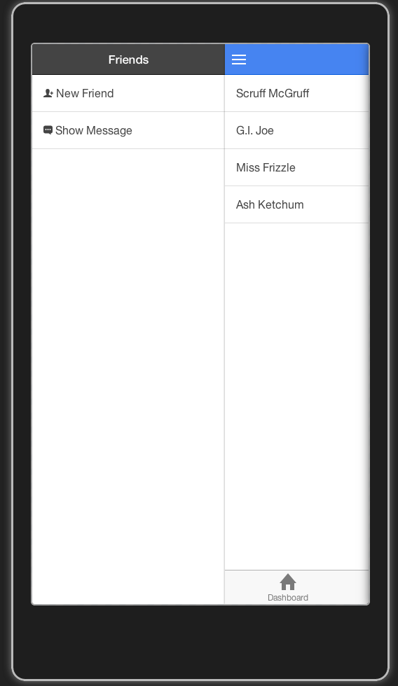

CoffeeScript Ionic Starter with Tabs and context-sensitive SideMenu
===


Starting point for developing Ionic apps with coffeescript, tabs and a context-sensitive side-menu.

This project is based on [StephenGrider's prototype project](https://github.com/StephenGrider/CoffeeScript-Ionic-Starter)



Getting Started
---

Enjoy coffeescript + sass w/ live reloading.

```
npm install
gulp watch
ionic serve
```
Coffeescript files in www/coffee will be compiled to JS and concated into www/js/application.js.  Sass files in www/sass will be compiled to CSS and concated into www/css/style.css.

Changes to any files in the project directory will trigger a reload in your browser, complete with your newly concated+compiled sass+coffee files!

###Gulp CoffeeScript Quirks
Since the gulp coffee script task does not recover from compilation errors there's an alternative way to start coffee script compilation.  
Use `npm start to trigger compilation with a watch (dirty misuse of npm's script hooks, I know)

#What is this Template about?

This template demonstrates one way to combine IONIC's tabs with a side-menu. It allows you define context specific navigation
links to other pages but also to trigger actions on the current page (like the android action bar).

The projects makes use a specific controller, where you can define the content of your side menu (if needed). Since triggering state transitions 
programmatically (e.g. $state.go) leads to problems with the back-button, there's also a modified back button directive that
uses the same controller ('NavigationCtrl').  
As a result you basically describe parts of a state machine within the navigation controller, where you define to which state you
 want to go back. If such a 'back state' is defined, the back button is rendered and will take you there.
 
##Defining a Context Menu (Side Menu)
Everthing is defined in a variable called `state` in the `NavigationCtrl` (see `www/coffee/navigation-controller.coffee`). 
For every page that should posses a context menu register the corresponding state and define the required properties:  


* `title`: title that will appear on top of the menu  
* `items`: a list of menu items (see bellow)  
* `back`: name of the state that you want to go to via the back-button [optional]

####Items
* `label`: the menu item's text
* `icon`: the [ionicons](http://ionicons.com/) class name of the icon you want to use [optional]
* `state`: name of the state you want to go to or
* `event`: name of the event that should be broadcasted in order to inform the view controller about this action

###Example
    states =  
                 "tab.friends":  
                     title: "Friends"  
                     items: [  
                         {  
                             label: "New Friend"  
                             state: "tab.addfriend"  
                             icon: "ion-person-add"  
                         },  
                         {  
                             label: "Show Message"  
                             event: "showMessage"  
                             icon: "ion-chatbox-working"  
                         }  
                     ]  
                 "tab.friend-detail":  
                     back: "tab.friends"  
                 "tab.addfriend":  
                     back: "tab.friends"  

When using `event` you only need to register a corresponding event listener inside your controller:
 
     controllers.controller "FriendsCtrl", ['$scope', 'Friends', ($scope, Friends) ->
         $scope.friends = Friends.all()
         sayHello = -> alert "This is the message"
         $scope.$on "showMessage", sayHello
     ]